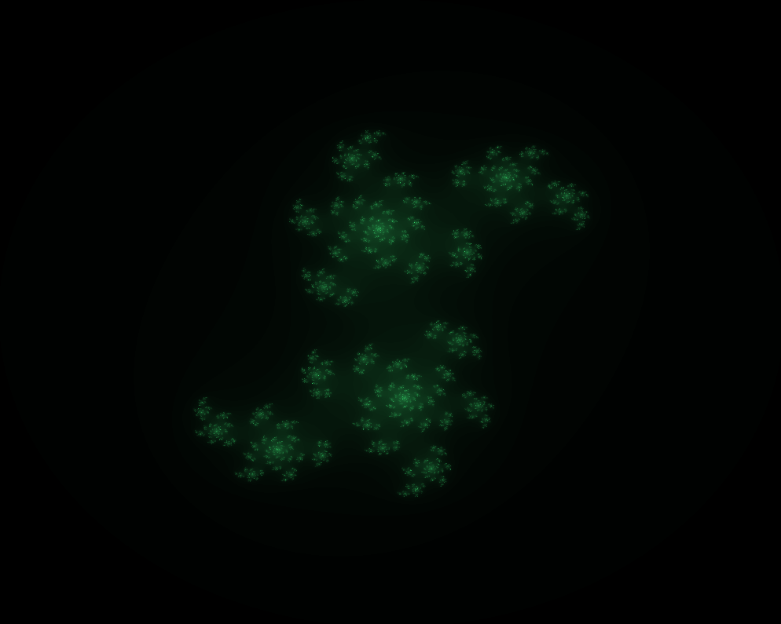

# T20MANDL: Drawing Mandelbrot and Julia sets
Last code update: 28.10.2021

This project uses GLUT to draw Mandelbrot and Julia sets. User can switch active set via M/J keys.

Mandelbrot set:

Julia set:

